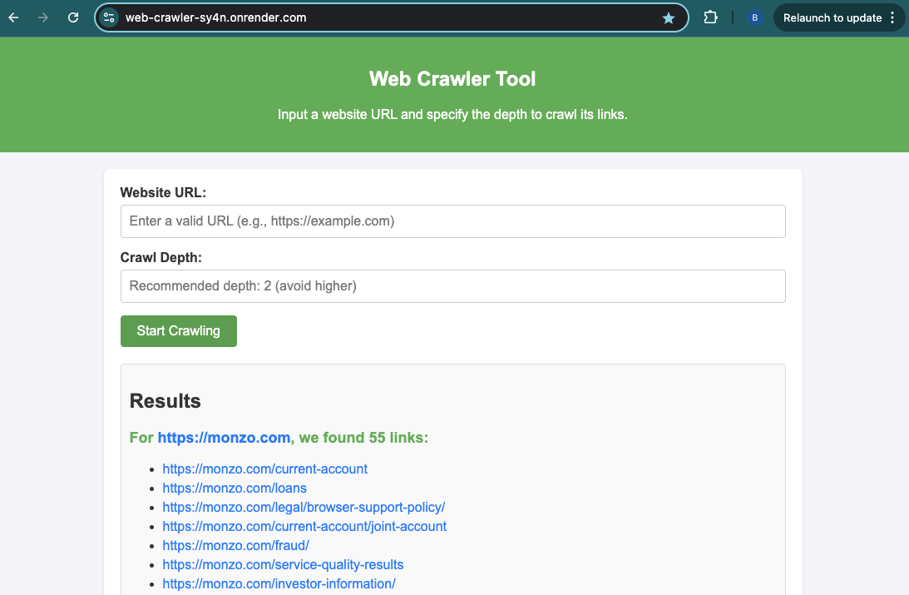

# Web Crawler 

A simple Python-based web crawler that starts from a given URL, crawls the website up to a specified depth, and collects all unique URLs found during the crawl. 
Given a starting URL, the crawler visits each URL it finds on the same domain. It prints each URL visited, and a list of links found on that page. 
The crawler uses asyncio to fetch URLs concurrently and respects `robots.txt` rules.

## Features
- Crawls a website up to a specified depth.
- Uses asyncio for concurrent URL fetching.
- Handles exceptions to avoid stopping the program.
- Respects `robots.txt` crawling rules to ensure ethical crawling.
- Supports configurable depth.
- Outputs visited URLs and links found on each page.

## Requirements
- Python 3.13+
- pip

To use a virtual environment, run:
```bash
python3 -m venv .venv
source .venv/bin/activate
```

To install the required dependencies, run:

```bash
pip install -r requirements.txt
```

### Run the app
Use the following command to run the app on your terminal. 
```bash
python3 app.py 
```

### Access the app
The webserver is now accessible at [localhost:5001](http://127.0.0.1:5001)

## Testing
Unit tests are provided to validate the functionality of the crawler. 
Run the tests using the following command and you'll also be able to see the coverage of the tests:
```bash
pytest --cov=website_crawler tests/
```

## DESIGN OVERVIEW

- **Web Crawler (web_crawler_with_async.py)**
  - Asynchronously fetches and processes web pages. 
  - Extracts and normalises links from web pages, ensuring only links within the same domain are considered.
  - Reads and respects `robots.txt` crawling rules to ensure ethical crawling.


- **Testing Suite (test_web_crawler_with_async.py)**
  - Contains unit tests for key functionalities in web_crawler_with_async.py. 
  - Uses mocking to simulate network responses and validate the crawler's functionality under different scenarios.


- **Web Interface (app.py)**
  - Provides a simple UI for users to input a start URL and crawling depth. 
  - Displays the results as a clickable list of discovered links grouped by the originating page.


- **Frontend Template (index.html)**
  - A minimal HTML template used by the Flask app to render the web interface. 
  - Includes a form for user input and a section to display the crawling results dynamically.


- **CI/CD configuration (python-app.yml)**
  - Configures a CI/CD pipeline using GitHub Actions to ensure software quality and deployment reliability. 
  - Workflow Overview:
    - Build Job:
      - Checks out the repository. 
      - Sets up the Python 3.13 environment. 
      - Installs required dependencies from requirements.txt. 
    - Test Job:
      - Ensures tests pass after building the application. 
      - Runs unit tests using `unittest` and measures coverage using `coverage`. 
    - Deploy Job:
      - Deploys the application to Render after tests succeed. 
      - Uses a secret environment variable `RENDER_DEPLOY_HOOK` for secure deployment.


## DEPLOYMENT TO GITHUB ACTIONS AND RENDER.COM

The project is integrated with `GitHub Actions` for continuous integration (CI), 
ensuring code quality and automated testing. The CI pipeline includes:
With this setup, every change to the codebase triggers an automated pipeline that tests and deploys the app to `Render`, 
allowing users to see the crawler in action via the web interface.

### Pipeline on Github actions


### Application screenshot on Render.com

You can find the website in this link: https://web-crawler-sy4n.onrender.com

#### Notes
- Due to running my code on the free tier, the server might be down due to inactivity. A refresh usually does the trick. If that doesn't work, sometimes I have to manually redeploy.
- The crawler is obviously slower on Render.com compared to locally. This is out of my control, but I still wanted to implement a CI/CD pipeline. 





## DESIGN CHOICES / TRADE OFF

## **1. Concurrency**

This project utilises asyncio to improve the efficiency of web scraping tasks by leveraging concurrency. 
Traditional sequential scraping methods process requests one at a time, which can be slow when waiting for server responses. 
By contrast, asyncio enables multiple requests to be handled concurrently, significantly reducing the overall runtime.

## **1.1 Why asyncio?**
Asyncio was chosen over `multithreading` because the web deployment uses Render's free tier, which has limited and very low CPU power. 
Since the scraping task is I/O-bound rather than CPU-bound, 
asyncio's non-blocking nature efficiently handles multiple requests without requiring additional threads, making it better suited to the constrained environment.

During development testing, by using asyncio we reduced crawling time from `18.57 seconds` to `3.58 seconds` when scraping https://monzo.com with `max-depth=2` - a massive speedup. 
When I used the `multithreading` module, speedups were observed on my local machine, but not in the Render server, which is why I ultimately chose `asyncio` as my preferred concurrency solution.

[Official documentation](https://docs.python.org/3/library/asyncio.html) about asyncio and its use.

[Article](https://www.zenrows.com/blog/speed-up-web-scraping-with-concurrency-in-python#how-to) on speeding up web scraping with concurrency in Python.

## **2. Error Handling**

The program includes robust error handling for HTTP requests using `try`/`except`, ensuring that failed requests don't crash the program.
- **Trade-off**: Some errors (e.g., transient network issues) might be recoverable. Implementing retry logic for specific exceptions could make the crawler more reliable.

## **3. Robots.txt Compliance**

The crawler respects robots.txt using `RobotFileParser`, adhering to best practices for web scraping.
- **Potential Improvement**: Robots.txt rules are fetched and parsed synchronously, adding latency. This could be pre-fetched or cached if crawling the same domain repeatedly.

## **4. Parsing**

 The web crawler processes each URL by fetching its content and parsing the links using the following logic:

- Visited URLs: Skips URLs that have already been processed to avoid redundancy.
- `Robots.txt` Compliance: Ensures the URL complies with the site's robots.txt rules.
- Link Extraction: Uses BeautifulSoup to extract all anchor tags `(<a>)`.
- Normalisation and Filtering:
  - Removes duplicates by storing links in a set.
  - Excludes links with schemes like `tel:` (phone links) and `mailto:` (email links).
  - Converts relative URLs to absolute ones using the `urljoin` function.
  - Encodes URLs to ensure special characters are handled properly.
  - Strips fragment identifiers (e.g., #section) for consistency.
  - Keeps only links within the same domain to focus on relevant content.
- Future Work 
  - Content Filtering: Analyse and prioritise links based on content relevance or keywords.
  - Improved URL Validation: Enhance checks for malformed or invalid URLs.
  - Error Handling: Improve robustness by handling edge cases like infinite redirects or heavily nested links.
  - Handling non-HTML content (e.g., PDFs, JSON APIs) could extend the crawler's versatility.

## **4.1 Parsing lxml vs html**
BeautifulSoup supports different parsers for handling `HTML`, with `lxml` and `html.parser` being common choices.

`lxml` is faster and better at handling malformed or complex `HTML`, making it ideal for large-scale web scraping projects. 
However, it requires the `lxml` library to be installed.
`html.parser` is slower and less robust with broken `HTML` but is built into Python, requiring no additional dependencies.

For this project, `lxml` was chosen for its speed and ability to handle poorly formatted web pages efficiently.

## **5. Test Coverage**

 The test suite covers key functionality, including edge cases like robots.txt compliance and invalid URLs.
- **Potential Improvement**: 
  - Add tests for concurrency (e.g., ensuring thread safety) and edge cases like circular links. 
  - Adding integration test with an outside website that we are confident on the number of links displayed.

## Additional future work

This take home technical task was timeboxed to 4 hours, which means that I had a lot more ideas for improvements, 
but they would not be feasible within the 4-hour timeline. On top of the improvements already mentioned, I list more below:

- **Testing Coverage**: The test coverage is pretty good right now at 88%, but it could be better. If I had more time I'd expand the test cases to cover more scenarios.
- **Cache**: Adding some caching system to access easily the most search links, in this case monzo.com.
- **Politeness policy**: Adding Semaphore will help limit the number of concurrent tasks, preventing overloading resources and ensuring better control over execution.
- **Feed-forward for long running crawling task**: The UX does not give any indication to the user that a search is ongoing. I did not prioritise this since you specifically said you don't care about UI/UX, but if I had more time I'd change that
- **Linting**: If I had more time, I'd add linting for PEP8 for consistent style and readable code.
- **Data Export**: Enable saving results to files in formats like JSON or CSV.
- **Error handling**: The app can crash due to long scraping times, with more than 4 hours I'd write better error handling
- **More url parsing**: Certain links that start with 'javascript:' are erroneously picked up by my crawler. Would remove if i had more time.
- **Backslash** : Certain links can be duplicated, because some have a trailing backslash ("monzo.com/") and some don't ("monzo.com"). These are seen as 
- **Certain website crawls display miscellaneous errors**: If I had more time I would inspect each of these errors and fix them.Example: `An unexpected error occurred: 'utf-8' codec can't decode byte 0xe2 in position 10: invalid continuation byte`